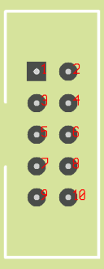

# AMPI I/O
### RPI I/O

Pin:  Usage | Pin:  Usage
------------- | ------------- 
1: 3V3|2: 5VIN|
3: SDA|4: 5VIN|
5: SCL|6: GND|
7: Amp Temp|8: DSP_RST|
9: GND|10:(15): MOTOR_A |
11(17):BTN_PREW |12: I2S_BCLK_IN|
13(27):AMP_EN |14: GND|
15:TAC_A |16(23): 12V_EN|
17: 3V3 |18: I2S_BCLK|
19:SPI_MOSI|20:GND|
21:(9) BTN_NEXT|22(25): SPI_DC|
23:SPI_CLK|24:(8) SPI_CS|
25:GND|26: S/PDIF_LOCK(INV)| 
27: (0) DSP_ACT|28(1): SPDIF EN|
29(5): ROT_BTN|30: GND|
31(6): ROT_A|32(12): FAN_A|
33(13):FAN_B|34: GND|
35:I2S_LRCK|36(16): MOTOR_B|
37: (26) ROT_B/IR|38: I2S_DATA_IN|
39:GND|40: I2S_DATA_OUT|
Note:
* No TAC_B connected
#
### Daughterboard I/O

Pinout  | 
------------- | 
1: Motor A |
2: Motor B | 
3: Fan B RPM |
4: 12VDC EN/Able |
5: 5VDC |
6: GND | 
7: Fan A RPM  | 
8: Fan A Power |
9: 12VDC |
10: Fan B Power |
#
#### OLED pinout

https://github.com/alidaf/raspberryPi/tree/master/displayPi/ssd1322-spi